# MARKDOWN NOTES

https://www.markdowntutorial.com/

## ITALICS AND BOLD
 For italics, the word must be surrounded by underscores (_)
 ie: _word_

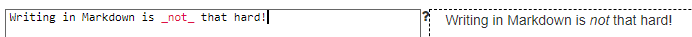

 For bold, the word must be surrounded by two asterisks (**)
 ie: **word**

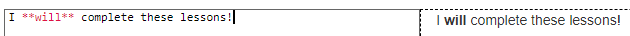

 Both bold and italics can be used in the same sentence

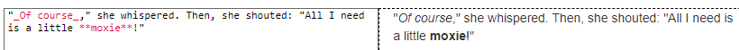

 Both bold and italics can be used in the same word
 ie: **_word_**

 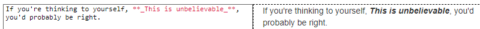

 ## HEADERS

 To make a header, the word must be preceded by #. Different number of # determines the size of the header, being one # the biggest header.
 
 # WORD
 ## WORD
 ### WORD

 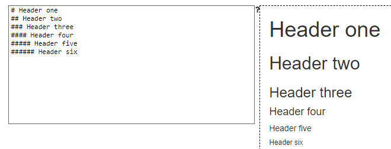

 A header can't be made bold. Instead, some words can be italized 

 ### word of word and _word_

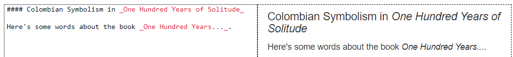

## LINKS

There are to types of links. 
Inline link. First the text is wrapped in [], the link related to that text is placed inmediately in ().
ie. [Visit Github:](www.github.com)
ie. **Visit** [Github](www.github.com)

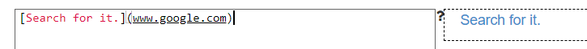

Enphasis can be made on links, on the text, words can be bold.
ie. [**Visit** Github](www.github.com)

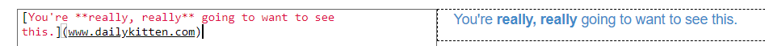

Links can also be made on headers. 
ie. 
## Visit [Github](ww.github.com)

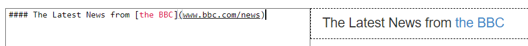

The second type of link is the reference. That link reference to another part of the text.
First, in square brackets must go the text that would be referenced. Then followed by another square brackets must be wrote a tag. Later in the file that tag in square brackets will reference a link.

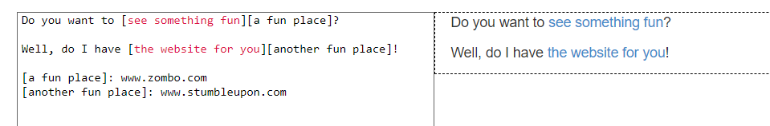

## IMAGES
Insert images in a md file is very similar as using links.
As well as links, there are two types of images and renderizes in the same way as links do.
**The difference between links and imaages is that, later are preceded by !.**
The first image style is _inline image_, for inserting an inline image first goes the exclamation followed by [] in which text must go, then in round brackets goes the link of the image.
ie. .

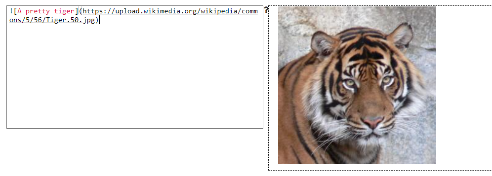

In the same way referenced links work, referenced images does. In the first square brackets must be the text of the image, followed by square brackets with tag. Later on the file thaat tag will reference a image.

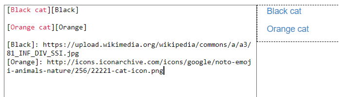

